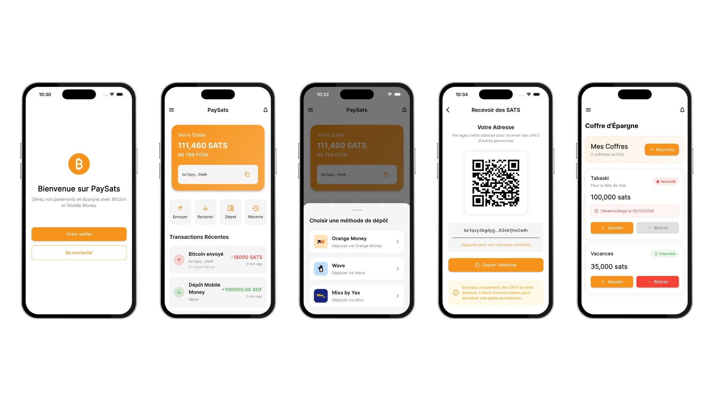

# PaySats

## Description

**PaySats** est un super-wallet mobile révolutionnaire développé avec Flutter qui transforme les services financiers en Afrique de l'Ouest. Cette application combine Bitcoin, Mobile Money, épargne et investissement dans une seule interface simple et intuitive.

## Vision

Rendre les paiements, l'épargne et l'investissement accessibles à tous au Sénégal et en Afrique de l'Ouest, sans dépendre des banques traditionnelles.

**PaySats = Mobile Money + Bitcoin + Épargne + Investissement**

## Fonctionnalités Principales

### 💸 Paiements et Transferts
- **Mobile Money intégré** : Connexion avec Wave, Orange Money, Free Money
- **Bitcoin Lightning** : Paiements rapides et peu coûteux via QR codes
- **Envoi/Réception** : Transferts d'argent instantanés entre utilisateurs
- **Conversion automatique** : Dépôt Mobile Money → Bitcoin (sats)
- **Retrait facile** : Bitcoin → Mobile Money en FCFA

### 🏦 Épargne Intelligente (Vaults)
- **Coffres personnalisés** : Création d'objectifs d'épargne (Tabaski, études, projets)
- **Verrouillage temporel** : Blocage des fonds pour 1, 3, 6, 12 mois
- **Épargne automatique** : Programmation de virements réguliers
- **Défis communautaires** : Épargne en groupe avec famille/amis
- **Récompenses** : Intérêts et bonus pour l'épargne long terme

### 📈 Investissements Accessibles
- **Actions internationales** : Apple, Tesla, Google, Amazon...
- **Marché local** : Actions BRVM (Bourse Régionale des Valeurs Mobilières)
- **Projets communautaires** : Crowdfunding et investissements locaux
- **Obligations d'État** : Titres du gouvernement sénégalais
- **Microfinance** : Prêts peer-to-peer et investissements agricoles

### 🔒 Sécurité Avancée
- **Authentification biométrique** : Empreinte digitale et reconnaissance faciale
- **PIN sécurisé** : Code d'accès personnel
- **Chiffrement end-to-end** : Protection des données sensibles
- **Backup multi-signatures** : Sécurité renforcée pour gros montants

### 🌍 Adapté au Contexte Local
- **Langues locales** : Support du Français et Wolof
- **Mode hors-ligne** : Fonctionnalités essentielles sans internet
- **Téléphones bas de gamme** : Optimisé pour tous les appareils
- **Interface culturelle** : Design adapté aux habitudes locales

## Captures d'écran




## Technologies utilisées

- **Flutter/Dart** : Développement cross-platform (iOS, Android, Web)
- **Provider** : Gestion d'état réactive
- **Bitcoin Lightning Network** : Paiements rapides et peu coûteux
- **APIs Mobile Money** : Intégration Wave, Orange Money, Free Money
- **CoinGecko API** : Taux de change en temps réel
- **BRVM API** : Données boursières locales
- **Chiffrement AES** : Sécurité des données utilisateur

## Installation

### Prérequis

- Flutter SDK (3.7.2 ou supérieur)
- Dart (3.0.0 ou supérieur)
- Android Studio / Xcode
- Compte développeur pour APIs Mobile Money

### Étapes d'installation

1. Clonez ce dépôt :
   ```bash
   git clone https://github.com/votre-username/PaySats.git
   ```

2. Accédez au répertoire du projet :
   ```bash
   cd PaySats
   ```

3. Installez les dépendances :
   ```bash
   flutter pub get
   ```

4. Configurez les clés API :
   ```bash
   # Créez un fichier .env avec vos clés API
   cp .env.example .env
   ```

5. Lancez l'application :
   ```bash
   flutter run
   ```

## Configuration

### Variables d'environnement

Créez un fichier `.env` à la racine du projet :

```env
# APIs Mobile Money
WAVE_API_KEY=votre_cle_wave
ORANGE_MONEY_API_KEY=votre_cle_orange
FREE_MONEY_API_KEY=votre_cle_free

# Bitcoin Lightning
LIGHTNING_NODE_URL=votre_noeud_lightning
LIGHTNING_MACAROON=votre_macaroon

# APIs Financières
COINGECKO_API_KEY=votre_cle_coingecko
BRVM_API_KEY=votre_cle_brvm
```

## Roadmap

- [x] **Phase 1** : Refactoring et configuration de base
- [ ] **Phase 2** : Authentification et intégration Mobile Money
- [ ] **Phase 3** : Fonctionnalités Bitcoin Lightning
- [ ] **Phase 4** : Système d'épargne (Vaults)
- [ ] **Phase 5** : Plateforme d'investissement
- [ ] **Phase 6** : Fonctionnalités sociales et gamification
- [ ] **Phase 7** : Sécurité avancée et conformité
- [ ] **Phase 8** : Optimisation et déploiement

## Contribution

Les contributions sont les bienvenues ! Consultez notre [guide de contribution](CONTRIBUTING.md) pour plus d'informations.

## Licence

Ce projet est sous licence MIT. Voir le fichier [LICENSE](LICENSE) pour plus de détails.

## Contact

- **Email** : contact@paysats.com
- **Twitter** : [@PaySatsApp](https://twitter.com/PaySatsApp)
- **Telegram** : [PaySats Community](https://t.me/paysats)

---

**PaySats - L'avenir des services financiers en Afrique de l'Ouest** 🚀
   ```bash
   flutter pub get
   ```

4. Lancez l'application :
   ```bash
   flutter run
   ```

## Structure du projet

```
lib/
├── main.dart                # Point d'entrée de l'application
├── screens/                 # Écrans de l'application
│   ├── home_screen.dart     # Écran d'accueil
│   ├── send_screen.dart     # Écran d'envoi de sBTC
│   ├── receive_screen.dart  # Écran de réception de sBTC
│   └── ...
├── services/                # Services métier
│   ├── wallet_service.dart  # Gestion du portefeuille
│   └── ...
├── utils/                   # Utilitaires
└── widgets/                 # Widgets réutilisables
```

## Contribuer

Les contributions sont les bienvenues ! N'hésitez pas à ouvrir une pull request ou à signaler des problèmes.

## Licence

Ce projet est sous licence MIT.
